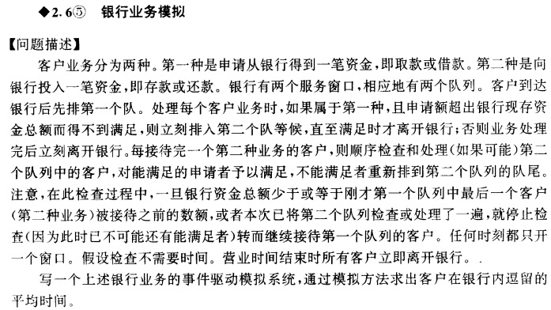
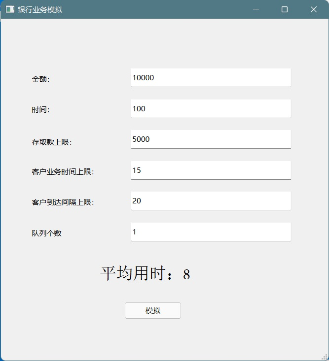
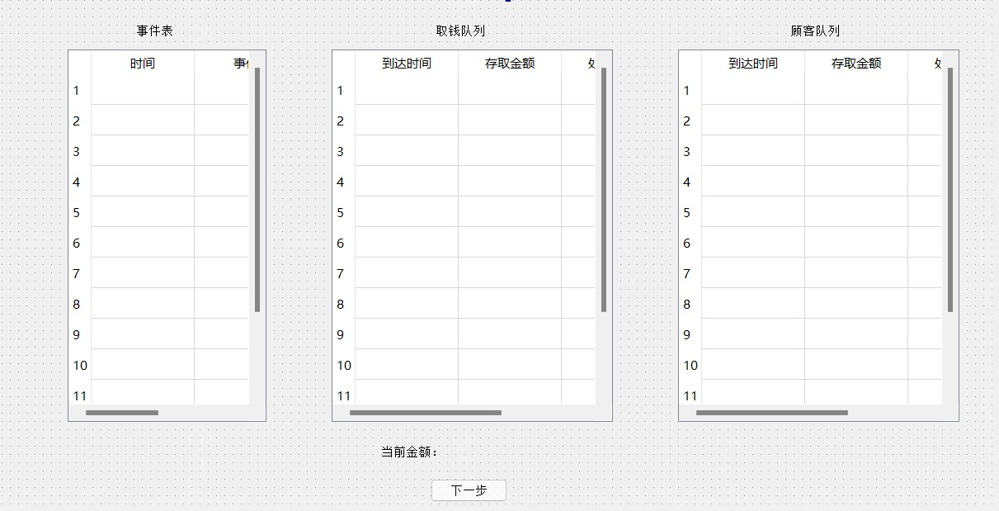
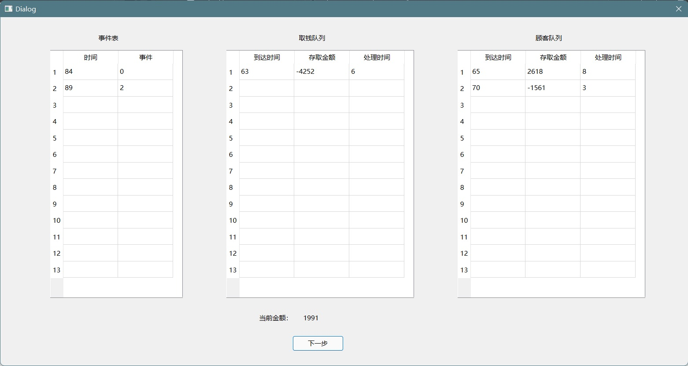

# 离散事件模拟实验报告（银行业务模拟）

完成了`实验基本要求`、`图形化界面`、`实验附加要求：多个第一种队列的服务窗口，通过输入数字确定数量`

## 实验要求

### 实验基本要求



​	**在此基础上实现图形化界面**

### 实验附加要求

>实现：多个第一种队列的服务窗口，通过输入数字确定数量（3 分）

## 设计思路

### 事件表与客户队列

将银行中发生的事件分为两类，到达事件和离开事件，使用队列数据结构来存储事件表，队列中从队头到队尾依次按照事件发生的时间顺序进行排列，每次出队时队头即为下一个发生的事件

将客户队列也使用队列数据结构进行存储，后来的客户直接入队，这样可以保证队列中先来后到的顺序

开始时向事件表中添加到达事件，在处理每一个到达事件时添加下一个到达事件。当客户队列非空时向事件表中添加离开事件，当处理离开事件时如果客户队列仍非空添加下一个离开事件，这样即可完成事件的驱动。

在处理客户时，若申请金额超出银行资金，则将其排入第二个队列等候。在每一个客户离开时统计其完成业务的等待时间，当银行营业结束后输出最终结果。

### 队列数据结构的实现

```C++
/**
 * @brief 队列的基本节点
 * @details data数组在客户队列中存储[0]-ArrivalTime [1]-money [2]-duration
 * @details data数组在事件队列中存储[0]-OccurTime [1]-Type
*/
typedef struct QNode
{
	QNode();
	QNode(int(&data)[3]);
	int data[3];
	QNode* next;
} QNode, * QuenePtr;

typedef struct LinkQunene
{
	LinkQunene();
	QuenePtr front;
	QuenePtr rear;
} LinkQunene;

class Quene
{
public:
	Quene();
	void enQuene(int(&data)[3]);
	void deQuene(int(&data)[3]);

	/**
	 * @brief 根据data[0]中存储的值升序排列
	*/
	void enQueneInOrder(int(&data)[3]);
	void moveFrontToRear();
	int getLength();
	QNode* getFront();
	void print();
	~Quene();

private:
	LinkQunene quene;
	int length;
};
```
实现了队列节点`QNode`，队列`LinkQuene`，以及队列数据类型`Quene`

`Quene`中包含**入队**、**出队**、**按序入队**、**获得长度**、**获得头节点**、**输出队列信息**等基本操作

### 银行类的实现

```C++
class Bank
{
public:
	/**
	 * @brief 构造函数
	 * @details 存取金额范围为 [-moneyScope, moneyScope-1]
	 * @details 处理业务时间范围为 [1,durationScope]
	 * @details 到来间隔时间范围为 [1,intertimeScope]
	 * @param totalMoney 总金额
	 * @param closeTime 营业时间
	 * @param moneyScope 客户存取金额范围
	 * @param durationScope 客户处理业务时间范围
	 * @param intertimeScope 客户到来间隔时间范围
	*/
	Bank(const int totalMoney = 10000, const int closeTime = 100000, const int moneyScope = 5000, const int durationScope = 15, const int intertimeScope = 30);

	/**
	 * @brief 处理事件
	 * @details data[1]存储事件种类Type，0-到达事件， 1-withdrawMoneyList离开事件，2-customerList1离开事件
	 * @deatils 事件的发生时间必须小于closeTime
	*/
	void handleEvent();
	bool isEventListNotEmpty();

	/**
	 * @brief 输出模拟结果
	 * @return 客户平均耗时
	*/
	int printResult();

	/**
	 * @brief 输出当前银行状态
	*/
	void printCurrentCondition();

private:

	/**
	 * @brief 总金额
	*/
	int totalMoney;

	/**
	 * @brief 营业时间
	*/
	int closeTime;

	/**
	 * @brief 客户总等待时间
	*/
	int totalTime;

	/**
	 * @brief 客户总等待时间
	*/
	int customerNum;

	bool dealingWithdrawMoneyList;
	int moneyScope;
	int durationScope;
	int intertimeScope;
	int bottomMoney;
	Quene withdrawMoneyList;
	Quene customerList1;
	Quene eventList;
	/**
	 * @brief 处理客户的离开事件
	 * @param leaveTime 离开事件的发生时间
	 * @param type 1-withdrawMoneyList 2-customerList1
	*/
	void departure(const int leaveTime, const int type);
	void customerArrived(const int arriveTime);

	/**
	 * @brief 检查并处理withdrawMoneyList中的客户
	 * @details 每次检查队头客户，若银行钱不够取则将将该客户排到队尾
	 * @details 直到所有客户都被检查一遍
	 * @details 或者银行钱已经少于上一个客户存钱之前的金额
	 * @param startTime 上一个存钱客户的离开时间
	*/
	void withdrawMoneyListCheck(const int startTime);

	/**
	 * @brief 生成离开事件并插入事件表
	 * @details 插入的客户一定在队头
	 * @details 若银行钱足够并且能在营业时间完成则插入成功
	 * @param startTime 开始处理顾客的时间
	 * @param type 1-withdrawMoneyList 2-customerList1
	 * @return 0-插入成功 -1-银行缺钱 1-超出营业时间
	*/
	int generateLeaveEvent(const int startTime, const int type);
};
```

银行类中存储了银行**总金额**、**营业时间**等信息,实现了**事件处理**、**输出结果**等基本功能。

### 附加功能的实现

```C++
Quene *customerList;
customerList = new Quene[listNum];
int getSmallerListNum();
```

创建一个第一种队列的数组，并编写从中获取最短队列的函数

### 图形化界面的实现

通过qt实现图形化界面，对第一种队列数为1的情况做出具体的中间过程模拟

## 关键代码讲解

### 队列

```C++
void Quene::enQueneInOrder(int(&data)[3])
{
	QuenePtr front = quene.front;
	if (front == NULL)
	{
		enQuene(data);
	}
	else
	{
		QuenePtr node = new QNode(data);
		if (node == NULL)
			abort();
		if (node->data[0] < front->data[0])
		{
			node->next = front;
			quene.front = node;
		}
		else
		{
			QuenePtr pre = quene.front;
			QuenePtr cur = pre->next;
			while (cur)
			{
				if (pre->data[0] <= data[0] && data[0] <= cur->data[0])
					break;
				pre = cur;
				cur = pre->next;
			}
			pre->next = node;
			node->next = cur;
			if (!cur)
				quene.rear = node;
		}
		length++;
	}
}
```

队列数据结构中实现了通过逐个比较队列中节点的`data`域来寻找入队时合适的插入位置，以便完成事件表的按序排列

```C++
void Quene::moveFrontToRear()
{
	if (length > 1)
	{
		QuenePtr front = quene.front;
		quene.front = front->next;
		front->next = NULL;
		quene.rear->next = front;
		quene.rear = front;
	}
}
```

此处实现将队头节点移动到队尾，以便实现循环检测取钱的第二个队中是否有人可以取钱

### 银行类

```C++
Bank::Bank(const int totalMoney, const int closeTime, const int moneyScope, const int durationScope, const int intertimeScope) : totalMoney(totalMoney),
closeTime(closeTime), totalTime(0), customerNum(0), dealingWithdrawMoneyList(false), moneyScope(moneyScope), durationScope(durationScope),
intertimeScope(intertimeScope), bottomMoney(0)
{
	//插入第一个到达事件
	int arrive[3] = { 0, 0, 0 };
	eventList.enQueneInOrder(arrive);
}
```

构造函数中初始化**银行总金额**、**营业时间**、**客户存取金额上限**、**客户办理业务时间上限**、**客户到达间隔上限**，并插入第一个到达事件

```C++
void Bank::handleEvent()
{
	int event[3];
	eventList.deQuene(event);
	switch (event[1])
	{
	case 0:
		customerArrived(event[0]);
		break;
	case 1: case 2:
		departure(event[0], event[1]);
		break;
	}
}
```

事件处理函数中根据事件表头的事件类型进行处理，0代表到达事件，其它数字代表离开事件，并用不同数字来区分不同队列的离开事件

```C++
void Bank::customerArrived(const int arriveTime)
{
	int money = rand() % moneyScope;
	money = (rand() % 2) > 0 ? money : -money;
	int duration = rand() % durationScope + 1;
	int customer[3] = { arriveTime, money, duration };

	//customerList1队尾插入新客户
	customerList1.enQuene(customer);
	int intertime = rand() % intertimeScope + 1;

	//在营业结束前新客户到来则插入到来事件
	if (arriveTime + intertime < closeTime)
	{
		int newarrive[3] = { arriveTime + intertime, 0, 0 };
		eventList.enQueneInOrder(newarrive);
	}

	//若此时未处理取钱客户 且 customerList1仅有1位刚到达客户
	//试图处理这位客户
	if (!dealingWithdrawMoneyList && customerList1.getLength() == 1)
	{
		int condition = generateLeaveEvent(arriveTime, 2);
		if (condition == -1)
		{
			int customer[3];
			customerList1.deQuene(customer);
			withdrawMoneyList.enQuene(customer);
		}
	}
}
```

客户到达时调用该函数进行处理，随机生成客户存取金额，办理业务事件、下一客户到达时间，并将下一客户的到达事件插入事件表中，若该客户为当前排队的第一个客户则试图插入这位客户的离开事件

```C++
void Bank::departure(const int leaveTime, const int type)
{
	int customer[3];
	if (type == 1)
	{
		withdrawMoneyList.deQuene(customer);
		dealingWithdrawMoneyList = false;
		withdrawMoneyListCheck(leaveTime);
	}
	else if (type == 2)
		customerList1.deQuene(customer);
	else
	{
		abort();
	}

	//客户等待时间为离开时间-到达时间
	totalTime += leaveTime - customer[0];
	totalMoney += customer[1];
	customerNum++;
	if (customer[1] > 0)
	{
		bottomMoney = totalMoney - customer[1];
		withdrawMoneyListCheck(leaveTime);
	}

	//若没有正在处理的客户
	if (!dealingWithdrawMoneyList)
	{
		int condition;

		//循环检查customerList1队头顾客并将银行钱不够取的顾客插入withdrawMoneyList
		//直到队列为空
		while ((customerList1.getLength() != 0) && (condition = generateLeaveEvent(leaveTime, 2)) == -1)
		{
			int customer[3];
			customerList1.deQuene(customer);
			withdrawMoneyList.enQuene(customer);
		}
	}
}
```

客户离开时调用该函数进行处理，将对应客户出队，将客户办理业务事件存储，更新银行的金额，如果这个客户存钱则检查取钱队列中是否有客户可以满足，如果没有就插入下一个客户的离开事件

```C++
void Bank::withdrawMoneyListCheck(const int startTime)
{
	if (withdrawMoneyList.getLength() == 0 || totalMoney <= bottomMoney || dealingWithdrawMoneyList)
		return;
	QuenePtr oldfirst = withdrawMoneyList.getFront();
	do
	{
		int condition = generateLeaveEvent(startTime, 1);
		if (condition == 0)
		{
			dealingWithdrawMoneyList = true;
			break;
		}
		else
		{
			withdrawMoneyList.moveFrontToRear();
		}
	} while (withdrawMoneyList.getFront() != oldfirst);
}
```

进行取钱客户队列的检查，如果队头的客户不能满足，则将队头客户排至队尾，直到发现可以满足的客户，或者整个队列循环一次为止。如果在处理过程中银行的钱已经少于开始处理时的钱，则剩下的客户必定不能满足，直接退出函数

```C++
int Bank::generateLeaveEvent(const int startTime, const int type)
{
	QuenePtr front;
	if (type == 1)
	{
		front = withdrawMoneyList.getFront();
	}
	else if (type == 2)
	{
		front = customerList1.getFront();
	}
	else
	{
		abort();
	}
	if (totalMoney + front->data[1] < 0) return -1;
	if (startTime + front->data[2] >= closeTime) return 1;
	int leave[3] = { startTime + front->data[2], type, 0 };
	eventList.enQueneInOrder(leave);
	return 0;
}
```

检查当前银行的金额能否满足，处理所需时间是否超出银行营业时间，如果都符合要求则插入客户的离开事件

### 附加功能

```C++
int BankAdvanced::getSmallerListNum()
{
	int min = customerList[0].getLength(), minNum = 2;
	for (int i = 1; i < listNum; i++)
	{
		if (customerList[i].getLength() < min)
		{
			min = customerList[i].getLength();
			minNum = i + 2;
		}
	}
	return minNum;
}
```

每次插入前获取最短队列，并插入到最短队列中

### 图形化的实现



```C++
void MainWindow::on_simulation_clicked()
{
    int totalmoney = ui->totalmoney->text().toInt();
    int closetime = ui->closetime->text().toInt();
    int moneyscope = ui->moneyscope->text().toInt();
    int durationscope = ui->durationscope->text().toInt();
    int intertimescope = ui->intertimescope->text().toInt();
    int listnum = ui->listnum->text().toInt();
    if(listnum == 1)
    {
        this->hide();
        Bank *bank = new Bank(totalmoney,closetime,moneyscope,durationscope,intertimescope);
        Step *step=new Step();
        step->setBank(bank);
        step->show();
        step->exec();
        this->show();
        while (bank->isEventListNotEmpty())
        {
            bank->handleEvent();
        }
        QString string = QString("平均用时：")+QString::number(bank->printResult());
        ui->value->setText(string);
        delete(bank);
    }
    else
    {
        BankAdvanced *bank = new BankAdvanced(totalmoney,closetime,moneyscope,durationscope,intertimescope,listnum);
        while (bank->isEventListNotEmpty())
        {
            bank->handleEvent();
        }
        QString string = QString("平均用时：")+QString::number(bank->printResult());
        ui->value->setText(string);
        delete(bank);
    }
}
```

点击按钮后获取主界面中填入的参数并传入Bank类中得到结果后进行输出

如果设定的第一种队列个数为1，会打开中间模拟窗口，隐藏主窗口，待中间模拟窗口关闭后重新显示主窗口



```C++
void Step::on_nextStep_clicked()
{
    if((bank->isEventListNotEmpty()))
    {
        bank->handleEvent();
        ui->totalMoney->setText(QString::number(bank->totalMoney));
        ui->eventList->clearContents();
        ui->withdrawMoneyList->clearContents();
        ui->customerList1->clearContents();
        QNode *node;
        node = bank->eventList.getFront();
        for(int i=0;node&&i<13;i++)
        {
            ui->eventList->setItem(i,0,new QTableWidgetItem(QString::number(node->data[0])));
            ui->eventList->setItem(i,1,new QTableWidgetItem(QString::number(node->data[1])));
            node=node->next;
        }
        node = bank->withdrawMoneyList.getFront();
        for(int i=0;node&&i<13;i++)
        {
            ui->withdrawMoneyList->setItem(i,0,new QTableWidgetItem(QString::number(node->data[0])));
            ui->withdrawMoneyList->setItem(i,1,new QTableWidgetItem(QString::number(node->data[1])));
            ui->withdrawMoneyList->setItem(i,2,new QTableWidgetItem(QString::number(node->data[2])));
            node=node->next;
        }
        node = bank->customerList1.getFront();
        for(int i=0;node&&i<13;i++)
        {
            ui->customerList1->setItem(i,0,new QTableWidgetItem(QString::number(node->data[0])));
            ui->customerList1->setItem(i,1,new QTableWidgetItem(QString::number(node->data[1])));
            ui->customerList1->setItem(i,2,new QTableWidgetItem(QString::number(node->data[2])));
            node=node->next;
        }
    }
    else
        accept();
}
```

点击按钮时会进行下一个事件的处理，并将事件处理后的结果显示

## 调试分析

### 时间复杂度

在银行金额充足的情况下，每个客户只需要被遍历一遍即可完成处理，时间复杂度为`O(n)`，但在银行金额不够大多数用户取时，每有一个用户存钱，就会遍历整个取钱队列，最差时间复杂度为`O(n^n)`

### 空间复杂度

每个客户只需要一个节点进行存储，每个客户分别对应一个到达事件和一个离开事件，空间复杂度为`O(n)`

### 遇到的bug

#### bug1

- bug内容：在尝试让队头的客户排到队尾时陷入死循环
  
- bug原因：每次将队头的空间释放后重新申请空间创建节点插入队尾，导致无法判断整个队列是否循环一次
  
- 解决方案：不进行空间的释放和重新申请，通过指针的改变直接改变队列的结构，以便通过节点的地址判断是否循环一次

#### bug2

- bug内容：队列中只有1个客户时，让队头的客户排到队尾时发生空指针异常
  
- bug原因：队列只有一个客户时无法将自身插入到自身的后面
  
- 解决方案：对队列中只有1个客户的情况进行单独判断

## 代码测试

### 运行状态测试

参数为：银行总金额 = 10000, 营业时间 = 100, 客户存取金额上限 = 5000, 客户办理业务时间上限 = 15, 客户到达间隔上限 = 30

```
event list:
(0,0,0)
customerList1:
withdrawMoneyList:
totalMoney:10000
totalTime:0
customerNum:0
dealingWithdrawMoneyList:0

event list:
(5,2,0)
(11,0,0)
customerList1:
(0,41,5)
withdrawMoneyList:
totalMoney:10000
totalTime:0
customerNum:0
dealingWithdrawMoneyList:0

event list:
(11,0,0)
customerList1:
withdrawMoneyList:
totalMoney:10041
totalTime:5
customerNum:1
dealingWithdrawMoneyList:0

event list:
(15,2,0)
(30,0,0)
customerList1:
(11,-4169,4)
withdrawMoneyList:
totalMoney:10041
totalTime:5
customerNum:1
dealingWithdrawMoneyList:0

event list:
(30,0,0)
customerList1:
withdrawMoneyList:
totalMoney:5872
totalTime:9
customerNum:2
dealingWithdrawMoneyList:0

event list:
(36,0,0)
(36,2,0)
customerList1:
(30,-1962,6)
withdrawMoneyList:
totalMoney:5872
totalTime:9
customerNum:2
dealingWithdrawMoneyList:0

event list:
(36,2,0)
(48,0,0)
customerList1:
(30,-1962,6)
(36,3281,2)
withdrawMoneyList:
totalMoney:5872
totalTime:9
customerNum:2
dealingWithdrawMoneyList:0

event list:
(38,2,0)
(48,0,0)
customerList1:
(36,3281,2)
withdrawMoneyList:
totalMoney:3910
totalTime:15
customerNum:3
dealingWithdrawMoneyList:0

event list:
(48,0,0)
customerList1:
withdrawMoneyList:
totalMoney:7191
totalTime:17
customerNum:4
dealingWithdrawMoneyList:0

event list:
(55,0,0)
(61,2,0)
customerList1:
(48,-2995,13)
withdrawMoneyList:
totalMoney:7191
totalTime:17
customerNum:4
dealingWithdrawMoneyList:0

event list:
(59,0,0)
(61,2,0)
customerList1:
(48,-2995,13)
(55,-2391,3)
withdrawMoneyList:
totalMoney:7191
totalTime:17
customerNum:4
dealingWithdrawMoneyList:0

event list:
(61,2,0)
(86,0,0)
customerList1:
(48,-2995,13)
(55,-2391,3)
(59,-292,7)
withdrawMoneyList:
totalMoney:7191
totalTime:17
customerNum:4
dealingWithdrawMoneyList:0

event list:
(64,2,0)
(86,0,0)
customerList1:
(55,-2391,3)
(59,-292,7)
withdrawMoneyList:
totalMoney:4196
totalTime:30
customerNum:5
dealingWithdrawMoneyList:0

event list:
(71,2,0)
(86,0,0)
customerList1:
(59,-292,7)
withdrawMoneyList:
totalMoney:1805
totalTime:39
customerNum:6
dealingWithdrawMoneyList:0

event list:
(86,0,0)
customerList1:
withdrawMoneyList:
totalMoney:1513
totalTime:51
customerNum:7
dealingWithdrawMoneyList:0

event list:
(89,2,0)
(93,0,0)
customerList1:
(86,4718,3)
withdrawMoneyList:
totalMoney:1513
totalTime:51
customerNum:7
dealingWithdrawMoneyList:0

event list:
(93,0,0)
customerList1:
withdrawMoneyList:
totalMoney:6231
totalTime:54
customerNum:8
dealingWithdrawMoneyList:0

event list:
customerList1:
(93,-4771,10)
withdrawMoneyList:
totalMoney:6231
totalTime:54
customerNum:8
dealingWithdrawMoneyList:0

6
BankingSimulation.exe (进程 7008)已退出，代码为 0。
按任意键关闭此窗口. . .
```

程序运行中间状态正常

### 运行结果测试

#### 测试1(单队列)

参数为：银行总金额 = 10000, 营业时间 = 100000, 客户存取金额上限 = 5000, 客户办理业务时间上限 = 15, 客户到达间隔上限 = 30

```
30
BankingSimulation.exe (进程 4284)已退出，代码为 0。
按任意键关闭此窗口. . .
```

在**客户到达间隔上限**远大于**办理业务时间上限**时，平均处理时间趋近于**客户到达间隔上限**

#### 测试2(单队列)

参数为：银行总金额 = 10000, 营业时间 = 100000, 客户存取金额上限 = 5000, 客户办理业务时间上限 = 15, 客户到达间隔上限 = 15

```
245
BankingSimulation.exe (进程 16512)已退出，代码为 0。
按任意键关闭此窗口. . .
```

在**客户到达间隔上限**与**办理业务时间上限**接近时，平均处理时间远大于**客户到达间隔上限**

#### 测试3(多队列)

参数为：银行总金额 = 10000, 营业时间 = 100000, 客户存取金额上限 = 5000, 客户办理业务时间上限 = 15, 客户到达间隔上限 = 15, 队列数 = 5

```
21
BankingSimulation.exe (进程 17852)已退出，代码为 0。
按任意键关闭此窗口. . .
```

在**第一种队列增加后**，平均处理时间明显下降


### 图形化测试



程序能正常模拟出中间过程，并在窗口关闭后自动显示主界面


<div STYLE="page-break-after: always;"></div>

## 实验总结

通过这次实验，我熟练掌握了离散事件模拟的问题分析与算法设计，熟悉了队列数据结构的使用，学习了使用qt进行图形化的方法，并学习了自己设计参数进行测试的过程。通过编写这样一个小项目，提高了代码组织能力和问题的发现与解决能力，同时对于生活中的银行排队问题有了更深入的理解。

## 附录

- Bank.h
  
  Bank类头文件

- Bank.cpp
  
  Bank类的实现，程序的主要模拟功能部分

- BankAdvanced.h
  
  BankAdvanced类头文件

- BankAdvanced.cpp
  
  BankAdvanced类的实现，程序的附加模拟功能部分，实现多条第一种队列的模拟

- Quene.h
  
  Quene类的头文件

- Quene.cpp
  
  Quene类的实现，实现队列数据结构

- step.h
  
  step类头文件

- step.cpp
  
  step类的实现，使用QDialog实现过程模拟

- step.ui
  
  qtUi文件，实现过程模拟的界面

- mainwindow.h
  
  mainwindow类头文件

- mainwindow.cpp
  
  mainwindow类的实现，实现主界面

- mainwindow.ui
  
  qtUi文件，实现主界面

- main.cpp
  
  实现主函数，调用mainwindow