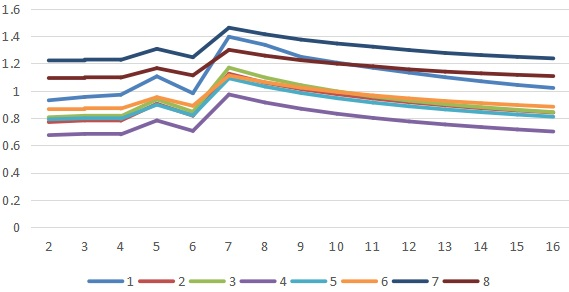
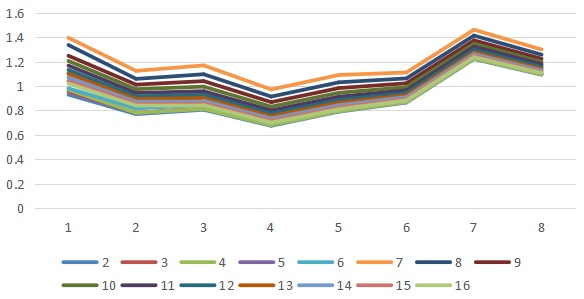
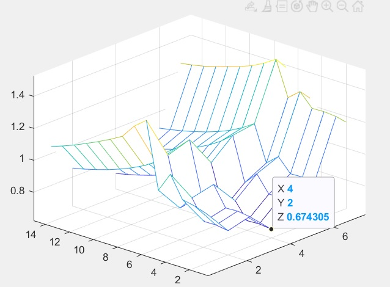

# Huffman 编码压缩/解压器实验报告

完成了`实验基本要求`、`【实现可指定的任意基本符号单元⼤小的Huffman压缩/解压缩算法】`、`【实现可指定的任意多元Huffman压缩/解压缩算法】`以及`【额外加分项】：实现可指定的对于基本符号单元⼤小和Huffman元数这两个参数的的任意组合的Huffman编码算法，统计分析这两个参数对于压缩/解压缩情况的联合影响`

## 实验要求

### 实验基本要求

> 基于 Huffman 编码实现⼀个压缩器和解压缩器（其中 Huffman 编码以字节作为统计和编码的基本符号单元），使其可以对任意的⽂件进⾏压缩和解压缩操作。针对编译⽣成的程序，要求压缩和解压缩部分可以分别独立运⾏。

> 每次运⾏程序时，用户可以指定只压缩/只解压缩指定路径的⽂件。实现的时候不限制与用户的交互⽅式，可供参考的⽅式包括但不限于
> - 根据命令行参数指定功能（压缩/解压缩）和输入/输出⽂件路径
> - GUI 界面
> - 运行程序后由用户交互输⼊指定功能和路径

### 实验选做内容

> 【实现可指定的任意基本符号单元⼤小的 **Huffman** 压缩**/**解压缩算法】原先我们的 Huffman 编码是对原⽂件的每⼀个字节为基本的符号单位进⾏统计和编码，试修改你的压缩/解压缩器，使其可以指定基本符号单元的⼤小，以 0.5 个字节为其⼤小变化的粒度

> 【实现可指定的任意多元 **Huffman** 压缩**/**解压缩算法】 原先我们的 Huffman 编码是针对基本符号单元⽣成⼆叉树进⾏编码，试修改你的压缩/解压缩器，使其可以指定⽣成 n 叉树进⾏ Huffman 编码，要求展示修改后压缩/解压缩指定⽂件时的 n 叉树 

## 设计思路

### 命令行交互

第一个参数为文件路径

第二个参数为功能选择（0：压缩 1：解压缩）

第三个参数为基本符号单元⼤小，可省略

第四个参数为Huffman树阶数，可省略

示例如下

```Bash
./HuffmanCode.exe [路径] [功能编号] (基本符号单元⼤小) (Huffman树阶数)
```

压缩后的文件将保存在与源文件相同的路径下，并加上后缀.cop

压缩和解压缩时提示如下

```bash
基本符号单元:2 Huffman树阶数:2
开始压缩
编码中……
压缩完成
```

```Bash
基本符号单元:2 Huffman树阶数:2
开始解压
解码中……
解压完成
```

运行时的Huffman树的链表存储如下


上图为2叉Huffman树


上图为填充了部分0权值节点的8叉Huffman树

### 用户交互类

```C++
class User
{
public:
	User(unsigned int halfbyte = 2, unsigned int branch = 2);
	~User();
	void compress();
	void decompress();
	std::string path;
private:
	unsigned int halfbyte;
	unsigned int readSupplement, writeSupplement;
	FILE* fpOrigin, * fpCompress;
	unsigned long long progress;
	std::map<unsigned int, unsigned int> charfrequency;
	HuffmanTree* huffmantree;
	void readFile(FILE*& fp);
	unsigned int readsymbol(unsigned int& bits);
	void calculateFrequency();
	void transcodeAndWriteFile();
	void getFrequencyAndLength();
	char* baseConversion(unsigned int ch, char destination[]);
	std::string baseDecode(unsigned char ch);
	void checkAndSave(char temp[], const unsigned int num);
	void decodeAndWriteFile();
};
```

提供压缩和解压缩两个`public`函数，并存储`基本符号单元大小`，`压缩文件和解压缩文件指针`，`字符频数表`，`Huffman树`

### HuffmanTree类

```C++
struct HTNode
{
	unsigned int weight;
	unsigned int parent, child[16] = { 0 };
	unsigned int ch;
	HTNode()
	{
		weight = 0;
		parent = 0;
		ch = 0;
	}
};

class HuffmanTree
{
public:
	HuffmanTree(unsigned int halfbyte, unsigned int branch);
	~HuffmanTree();
	void createTree(std::map<unsigned int, unsigned int> charfrequency);
	void createCode();
	unsigned int getUnitSize();
	std::unordered_map<unsigned int, std::string> code;

	// 叶子节点数
	unsigned int leavesnum;

	// 总字符数为n，最多需要2*n-1个节点，0号单元未用
	HTNode* HT;
	unsigned int branch;
private:
	unsigned int halfbyte;
	void selectMinNum(const unsigned int i, std::pair<unsigned int, unsigned int> minNum[]);
};
```

实现Huffman树的节点`HTNode`类与`HuffmanTree`类，`HTNode`包含节点权重，父节点，孩子和字符，`HuffmanTree`实现了创建HuffmanTree、生成Huffman编码、获取单元大小三个`Public`函数

## 关键代码讲解

### 命令行交互

```C++
User* user;
if (argc == 5)
{
	user = new User(atoi(argv[3]), atoi(argv[4]));
	std::cout << "基本符号单元:" << argv[3] << " " << "Huffman树阶数:" << argv[4] << std::endl;
}
else if (argc == 3)
{
	std::cout << "基本符号单元:" << 2 << " " << "Huffman树阶数:" << 2 << std::endl;
	user = new User();
}
else
{
	std::cout << "参数错误" << std::endl;
	exit(2);
}
user->path = argv[1];
if (atoi(argv[2]) == 0)
{
	user->compress();
}
else if (atoi(argv[2]) == 1)
{
	user->decompress();
}
```

判断程序接受的参数个数是否符合要求，再根据参数选取`基本符号单元⼤小`、`Huffman树阶数`对相应的文件进行压缩或解压缩

### 用户交互类

#### 压缩

```C++
void User::compress()
{
	std::cout << "开始压缩" << std::endl;
	readFile(fpOrigin);
	calculateFrequency();
	std::cout << "编码中……" << std::endl;
	huffmantree->createTree(charfrequency);
	huffmantree->createCode();
	transcodeAndWriteFile();
	std::cout << "压缩完成" << std::endl;
}
```

压缩函数中首先使用二进制模式打开文件，然后计算字符频数，创建Huffman树，生成Huffman编码，最后将源文件根据Huffman编码生成压缩文件

```c++
unsigned int User::readsymbol(unsigned int& bits)
{
	unsigned int symbol = 0, i = 0;
	static int unuse = 0;
	static unsigned char ch, high, low;
	for (i = 0; i < halfbyte; i++)
	{
		if (!unuse)
		{
			ch = fgetc(fpOrigin);
			if (feof(fpOrigin)) break;
			high = ch >> 4;
			low = ch & 15;
			unuse = 2;
		}
		if (unuse == 2) symbol = (symbol << 4) + high;
		else symbol = (symbol << 4) + low;
		unuse--;
	}
	bits = i;
	return symbol;
}
```

读取字符时，先将字符按半个字节拆分，再按照需要合并

```C++
// 预留写最后补零个数的位置
fwrite(&writeSupplement, sizeof(unsigned int), 1, fpCompress);
fwrite(&readSupplement, sizeof(unsigned int), 1, fpCompress);
fwrite(&charfrequencysize, sizeof(unsigned int), 1, fpCompress);
for (auto i : charfrequency)
{
	fwrite(&i.first, sizeof(unsigned int), 1, fpCompress);
	fwrite(&i.second, sizeof(unsigned int), 1, fpCompress);
}
std::string temp = "";
fseek(fpOrigin, 0l, SEEK_SET);
do
{
	unsigned int bits = 0;
	unsigned int symbol = readsymbol(bits);
	if (feof(fpOrigin))
	{
		if (bits != 0)
		{
			for (unsigned int i = bits; i < halfbyte; i++)
			{
				symbol = symbol << 4;
			}
			temp += huffmantree->code[symbol];
		}
	}
	else temp += huffmantree->code[symbol];
	if (feof(fpOrigin))
	{
		for (unsigned int i = 0; i < huffmantree->getUnitSize() - 1; i++)
			temp += "0";
	}
	while (temp.length() >= huffmantree->getUnitSize())
	{
		char byte[9] = { 0 };
		strncpy(byte, temp.c_str(), huffmantree->getUnitSize());
		unsigned char bytetoch = (unsigned char)strtol(byte, NULL, huffmantree->branch);
		fputc(bytetoch, fpCompress);
		temp.erase(0, huffmantree->getUnitSize());
	}
	if (feof(fpOrigin))
	{
		fseek(fpCompress, 0l, SEEK_SET);
		writeSupplement = huffmantree->getUnitSize() - 1 - temp.length();
		fputc(writeSupplement, fpCompress);
	}
} while (!feof(fpOrigin));
```

最后生成压缩文件时，将额外补0的个数写在文件开头，紧接着写入词频表，最后依次读入源文件的字符转换后存入压缩文件

#### 解压

```c++
void User::decompress()
{
	std::cout << "开始解压" << std::endl;
	readFile(fpCompress);
	getFrequencyAndLength();
	std::cout << "解码中……" << std::endl;
	huffmantree->createTree(charfrequency);
	decodeAndWriteFile();
	std::cout << "解压完成" << std::endl;
}
```

解压缩时先读取压缩文件，获取词频，创建Huffman树后读取压缩文件译码生成源文件

```c++
std::string User::baseDecode(unsigned char ch)
{
	std::string result = "";
	for (unsigned int i = 0; i < huffmantree->getUnitSize(); i++)
	{
		result += ch % huffmantree->branch + '0';
		ch = ch / huffmantree->branch;
	}
	return result;
}
```

该函数实现将k叉Huffman树得到的k进制串转换为字符的功能

```c++
while (true)
{
	if (num == 0)
	{
		ch = fgetc(fpCompress);
		num = huffmantree->getUnitSize();
		result = baseDecode(ch);
		if (--progress == 0) break;
	}
	if (huffmantree->HT[p].child[0] != 0)
	{
		p = huffmantree->HT[p].child[result.c_str()[--num] - '0'];
	}
	else
	{
		char ch[10];
		strcat(temp, baseConversion(huffmantree->HT[p].ch, ch));
		checkAndSave(temp, 8u);
		p = root;
	}
}
while (num >= (int)writeSupplement)
{
	if (huffmantree->HT[p].child[0] != 0)
	{
		p = huffmantree->HT[p].child[result.c_str()[--num] - '0'];
	}
	else
	{
		char ch[10];
		strcat(temp, baseConversion(huffmantree->HT[p].ch, ch));
		checkAndSave(temp, 8u);
		p = root;
	}
}
checkAndSave(temp, readSupplement);
```

根据构建好的Huffman树得到原始字符，去除压缩时填充部分后得到源文件

### HuffmanTree类

```C++
void HuffmanTree::createTree(std::map<unsigned int, unsigned int> charfrequency)
{
	leavesnum = charfrequency.size();
	leavesnum += branch - 1 - (leavesnum - 1) % (branch - 1);
	HT = new HTNode[leavesnum + (leavesnum - 1) / (branch - 1) + 1]();
	leavesnum = 0;
	for (auto i : charfrequency)
	{
		HT[++leavesnum].ch = i.first;
		HT[leavesnum].weight = i.second;
	}
	if (leavesnum == 0 || leavesnum == 1)
	{
		std::cout << "无法构造Huffman树" << std::endl;
		exit(1);
	}
	leavesnum += branch - 1 - (leavesnum - 1) % (branch - 1);
	for (unsigned int i = leavesnum + 1; i <= leavesnum + (leavesnum - 1) / (branch - 1); i++)
	{
		std::pair<unsigned int, unsigned int>  minNum[16];
		selectMinNum(i - 1, minNum);
		for (unsigned int j = 0; j < branch; j++)
		{
			HT[minNum[j].first].parent = i;
			HT[i].child[j] = minNum[j].first;
			HT[i].weight += minNum[j].second;
		}
	}
}

void HuffmanTree::createCode()
{
	for (unsigned int i = 1; i <= leavesnum; i++)
	{
		if (HT[i].weight == 0) continue;
		code[HT[i].ch] = "";
		for (unsigned int j = i; HT[j].parent; j = HT[j].parent)
		{
			unsigned int parent = HT[j].parent;
			for (unsigned int k = 0; k < branch; k++)
			{
				if (HT[parent].child[k] == j)
				{
					if (k < 10)
						code[HT[i].ch] += '0' + k;
					else code[HT[i].ch] += 'a' + k - 10;
					break;
				}
			}
		}
		std::reverse(code[HT[i].ch].begin(), code[HT[i].ch].end());
	}
}

bool compare(std::pair<unsigned int, unsigned int> a, std::pair<unsigned int, unsigned int> b)
{
	return a.second < b.second;
}

void HuffmanTree::selectMinNum(const unsigned int i, std::pair<unsigned int, unsigned int> minNum[])
{
	unsigned int j = 0;
	for (unsigned int i = 0; i < branch; i++)
	{
		while (true)
		{
			j++;
			if (HT[j].parent == 0)
			{
				minNum[i].first = j;
				minNum[i].second = HT[j].weight;
				break;
			}
		}
	}
	std::sort(minNum, minNum + branch, compare);
	for (j = j + 1; j <= i; j++)
	{
		if (HT[j].parent == 0)
		{
			if (HT[j].weight < minNum[branch - 1].second)
			{
				minNum[branch - 1].first = j;
				minNum[branch - 1].second = HT[j].weight;
				std::sort(minNum, minNum + branch, compare);
			}
		}
	}
}
```

构造Huffman树和生成Huffman编码部分参考课本`6.6.2`节内容，此处拓展为k叉树的情况对每个叶子节点生成k进制串

```c++
unsigned int HuffmanTree::getUnitSize()
{
	switch (branch)
	{
	case 2:
		return 8;
	case 3:
		return 5;
	case 4:
		return 4;
	case 5:case 6:
		return 3;
	default:
		return 2;
	}
}
```

该函数返回一个字节所存储的k进制数的个数

## 调试分析

### 时间复杂度

#### Huffman树

记叶子节点个数为n，在构造k叉Huffman树的过程中，取最小节点的次数为`O(n/k)`，每次取最小节点的复杂度为`O(n)`，将所有节点合并的时间复杂度为`O(n)`，则构造Huffman树的时间复杂度为`O(n^2/k+n)`即`O(n^2/k)`

在求Huffman编码的过程中，叶子节点的平均深度为`O(logn)`，对n个叶子节点分别求编码的总时间复杂度为`O(nlogn)`

#### 文件读写

文件读写的时间复杂度为`O(m)`，m为文件中含有的字节数

#### 压缩/解压缩的总复杂度

总时间复杂度为`O(n^2/k+m)`

### 空间复杂度

存储Huffman树以及Huffman编码的空间复杂度为`O(n)`

### 遇到的bug

#### bug1

- bug内容：使用较大的基本符号单元时程序发生溢出
  
- bug原因：对每个字符都分配存储空间，存储词频表所用空间过大
  
- 解决方案：按需分配词频表的存储空间，对词频为0的字符不分配空间

#### bug2

- bug内容：使用k叉Huffman树解压缩时，无法还原出原先的k进制字符串
  
- bug原因：k进制串的高位部分0被忽略
  
- 解决方案：确定每个进制在一个字符中所存的位数，以便解压缩时得出高位是否含0

## 代码测试

| 阶数/单元 | 1    | 2    | 3    | 4    | 5    | 6    | 7    | 8    |
| --------- | ---- | ---- | ---- | ---- | ---- | ---- | ---- | ---- |
| 2         | 0.93 | 0.77 | 0.81 | 0.67 | 0.79 | 0.86 | 1.22 | 1.09 |
| 3         | 0.95 | 0.78 | 0.82 | 0.68 | 0.80 | 0.87 | 1.23 | 1.10 |
| 4         | 0.97 | 0.78 | 0.81 | 0.68 | 0.79 | 0.87 | 1.23 | 1.10 |
| 5         | 1.11 | 0.90 | 0.94 | 0.78 | 0.90 | 0.95 | 1.31 | 1.17 |
| 6         | 0.98 | 0.82 | 0.85 | 0.71 | 0.82 | 0.89 | 1.25 | 1.11 |
| 7         | 1.40 | 1.12 | 1.17 | 0.97 | 1.09 | 1.11 | 1.46 | 1.30 |
| 8         | 1.34 | 1.06 | 1.10 | 0.91 | 1.03 | 1.06 | 1.41 | 1.26 |
| 9         | 1.25 | 1.01 | 1.04 | 0.87 | 0.98 | 1.02 | 1.37 | 1.22 |
| 10        | 1.21 | 0.97 | 1.00 | 0.83 | 0.94 | 0.99 | 1.35 | 1.20 |
| 11        | 1.17 | 0.94 | 0.96 | 0.80 | 0.91 | 0.97 | 1.32 | 1.18 |
| 12        | 1.13 | 0.92 | 0.93 | 0.77 | 0.89 | 0.94 | 1.30 | 1.16 |
| 13        | 1.10 | 0.89 | 0.90 | 0.75 | 0.86 | 0.92 | 1.28 | 1.14 |
| 14        | 1.07 | 0.87 | 0.88 | 0.73 | 0.84 | 0.91 | 1.26 | 1.13 |
| 15        | 1.04 | 0.85 | 0.86 | 0.72 | 0.82 | 0.89 | 1.25 | 1.12 |
| 16        | 1.02 | 0.84 | 0.84 | 0.70 | 0.81 | 0.88 | 1.24 | 1.11 |

使用文本文件进行压缩测试，在不同的基本符号单元⼤小与Huffman树阶数下测得的压缩率如上，单元以半个字节计，1-8即为0.5-4个字节



如图所示，在基本符号单元相同时，2叉~4叉Huffman树的压缩率较小



在Huffman树阶数相同时，基本符号单元为2字节时压缩率最小，可能的原因是测试的文本文件采用ANSI编码，每个字符用两个字节存储，因此在基本符号单元为2字节时呈现出有规律的词频分布，压缩效率较高



使用MATLAB以压缩率为因变量，基本符号单元大小与Huffman树阶数为自变量作图并求得压缩率最低点如上，在基本符号单元⼤小为`2字节`，Huffman树阶数为`2`时压缩率最小为`67.4%`


## 实验总结

通过这次实验，我熟练掌握了使用Huffman树进行压缩和解压缩的方法，熟悉了树的基本存储结构，学习了使用命令行获取参数的方法，并学习了测试与分析测试结果的方法。通过编写这样一个小项目，提高了代码组织能力和问题的发现与解决能力，同时对于书上的算法的具体代码实现有了更深的理解。

## 附录

- User.h

  用户交互类头文件

- User.cpp

  用户交互类实现

- HuffmanTree.h

  Huffman树类头文件

- HuffmanTree.cpp

  Huffman树类实现

- test.cpp

  主函数

  